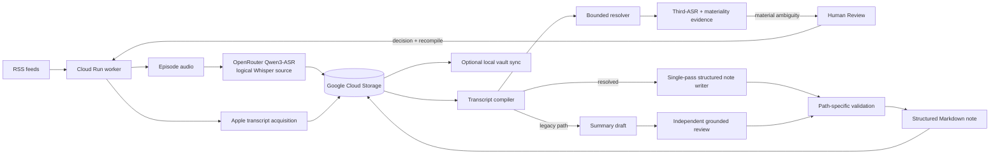
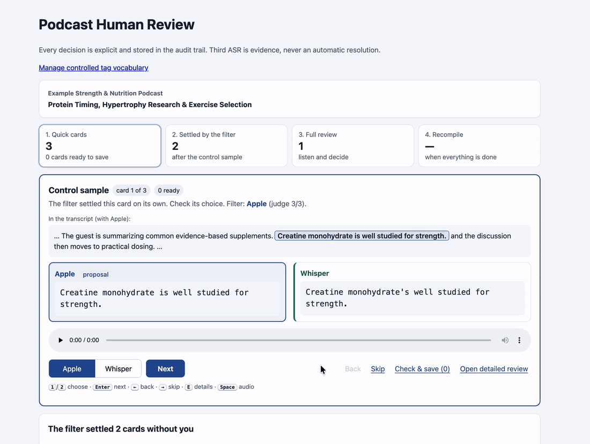
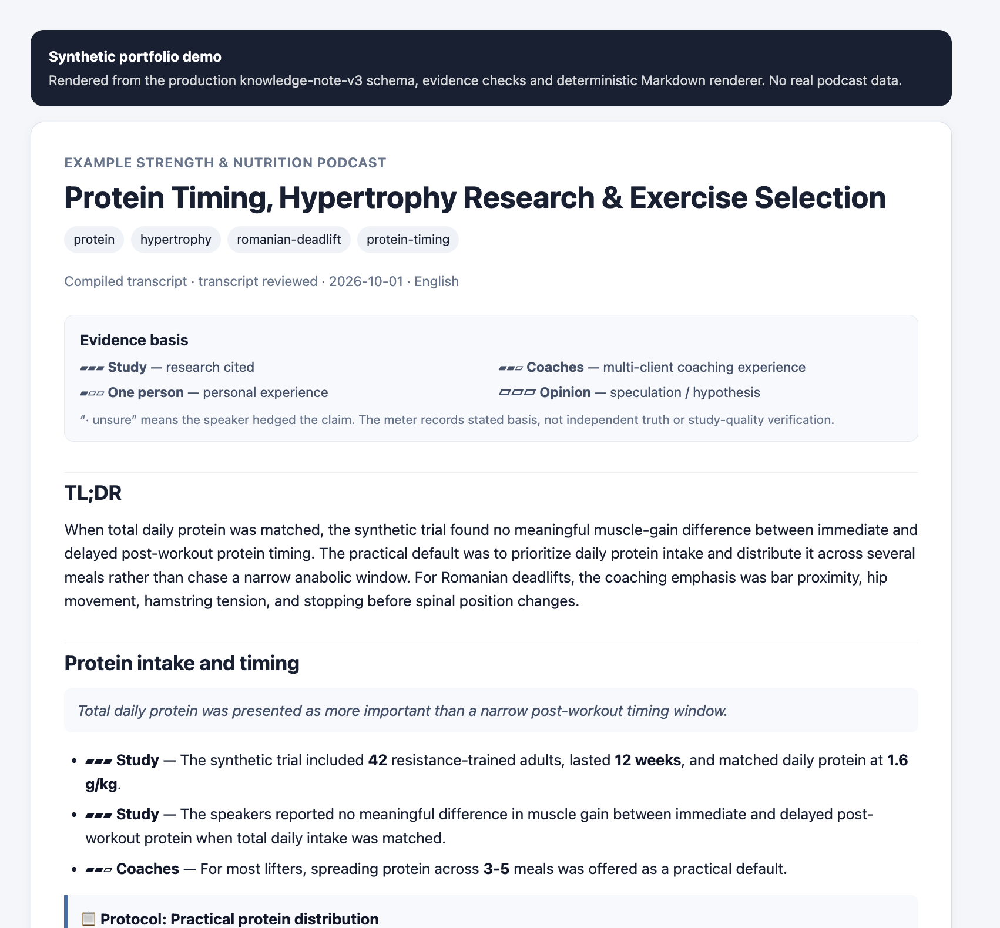

# Podcast Automation

[](https://github.com/wintersyntax/podcast-automation/actions/workflows/portfolio-ci.yml)


A resumable automation pipeline for evidence-heavy **exercise science, training and nutrition podcasts**. It combines independent transcript sources, preserves disagreements as evidence, routes ambiguous cases to human review, and produces durable structured knowledge notes.

This repository is a curated portfolio version of a larger private production project. Deployment-specific identifiers, personal paths, real podcast feed configuration and transcript-derived evaluation corpora are excluded or replaced with synthetic examples.

## Engineering highlights

- resumable RSS-driven episode processing with durable GCS-backed state
- independent Apple Podcasts and OpenRouter `qwen/qwen3-asr-1.7b` transcript acquisition with bounded chunking, retry and spend accounting
- transcript alignment and conservative multi-source reconciliation
- deterministic evidence/provenance checks around bounded AI-assisted resolution
- explicit Human Review for material unresolved conflicts, with prefetched Third-ASR evidence and a materiality-first quick-review queue
- episode-level AI budget admission, settlement and provenance tracking
- single-pass, transcript-grounded knowledge-note writer with deterministic publication checks
- an independent transcript-grounded summary-review path when the writer is not configured
- deterministic metadata/frontmatter construction for Markdown knowledge notes
- separate Cloud Run worker and Human Review service boundaries
- optional Slack signalling and macOS credential/sync helpers

## Domain focus

The system is tuned for long-form exercise and nutrition content where small transcription errors can change the meaning of the material being captured. The knowledge pipeline is designed to preserve and structure details such as:

- studies and papers mentioned by the speakers, including authors/year/name as heard, design, sample, duration and reported findings
- exercise selection, setup, execution and technique
- training variables, protocols, numerical recommendations and their conditions
- nutrition, supplementation, recovery and evidence-quality discussions
- practical takeaways while retaining whether a claim came from research, coaching experience, personal experience or another stated basis
- named sources and references for later retrieval

This makes the project intentionally more domain-aware than a generic podcast summarizer: the goal is to turn technical exercise/nutrition conversations into searchable notes without silently strengthening, normalizing or inventing what the speakers said.

## Why multiple transcript sources?

The historical `Whisper` source name is retained in storage/schema paths, but the current producer is OpenRouter `qwen/qwen3-asr-1.7b`. Producer identity includes the model and stitch policy, so artifacts from the earlier `whisper-large-v3` producer are not reused.

A fluent transcript is not necessarily a trustworthy transcript. Differences involving numbers, units, negations, names, citations or domain terminology can materially change meaning.

This system keeps independent sources separate, compares their evidence, resolves only what can be justified, and stops for human judgment when confidence is insufficient.

## Architecture



The important boundary is authority: model output can assist inside explicit contracts, but deterministic code owns identity, evidence IDs, budget accounting, state transitions, validation and publication gates. Unresolved speech evidence remains unresolved until a human decides it.

## Pipeline at a glance

1. Discover the latest configured RSS episode and resume older incomplete work.
2. Download episode audio to ephemeral worker storage.
3. Generate the logical "Whisper" source with OpenRouter `qwen/qwen3-asr-1.7b` in bounded chunks, with producer provenance, budget reservations, segment/word timestamp normalization and bounded rate-limit backoff.
4. Acquire an independent Apple transcript when available.
5. Store both source artifacts separately.
6. Align and compare the sources.
7. Apply deterministic equivalence/corroboration rules.
8. Use a bounded resolver only for eligible conflicts.
9. Prefetch bounded Third-ASR evidence for remaining cards and record a materiality verdict without granting either mechanism transcript authority.
10. Present Human Review as quick cards first, then one explicit settled-card confirmation, ordinary review for what remains, and finally recompile. Every stored choice remains an audited human decision.
11. Recompile after durable review decisions.
12. When a knowledge-writer preset is configured, generate a structured `knowledge-note-v3` note from the canonical transcript in one writer stage; otherwise use the summary draft, independent review and metadata path.
13. Apply deterministic structure and transcript-anchor checks to the writer note, or validate the accepted review chain on the legacy path.
14. Construct frontmatter deterministically and publish the final note only after its path's checks pass.

## Human Review

The same Flask review application can run locally or as a separate service. Review state is durable and generation-aware; recompile requests carry correlation identifiers so a later worker execution can continue the exact episode/review generation.



*The synthetic demo shows a high-risk study sample-size conflict (**42 vs 40 participants**) and a deliberately simplified exercise-name conflict (**Romanian deadlift vs Roman deadlift**). The exercise-name example is pedagogical: earlier compiler and bounded-resolution stages are intended to remove many obvious or low-risk differences before Human Review. The important boundary is that protected disagreements such as negations, protocol numbers, units, citations and other domain-sensitive mismatches are not silently normalized away.*

Current Human Review uses a materiality-first queue. Low-impact cards can be presented as a control sample, a fast Apple/Whisper choice, or a one-click proposal; cards the filter cannot safely simplify stay in ordinary review. A 10% control sample (at least two cards, excluding representation-only classes) checks the filter in real use. Third-ASR and older tier/batch/assisted surfaces remain advisory and are kept under advanced controls. The system never silently turns those signals into canonical transcript text.

Synthetic fixtures in `tests/fixtures/synthetic/` demonstrate the same review boundary without publishing real podcast transcript material.

## Knowledge-note output

The final knowledge artifact is static, so a GIF is not necessary here. The repository includes both a visual preview and a fully synthetic Markdown example rendered from the production note schema and deterministic renderer:



**[Open the generated knowledge-note example](examples/demo-knowledge-note.md)**

It shows the parts this project is designed to preserve for exercise/nutrition podcasts: research discussed, evidence-basis labels, training/nutrition protocols, exercise technique, numerical recommendations, takeaways, tags and sources mentioned.

The evidence meter describes **what basis the speaker gave for a claim**, not an independent rating of whether the claim is true or whether a cited study is high quality:

- **▰▰▰ Study** — the speaker explicitly cites research, a study, review or paper.
- **▰▰▱ Coaches** — coaching experience across multiple clients/athletes, or expert consensus reported by the speaker.
- **▰▱▱ One person** — one person's own experience or anecdote.
- **▱▱▱ Opinion** — hypothesis, speculation, or an "I think / I'd guess" claim without another stated basis.
- **· unsure** — appended when the speaker themselves hedges or expresses uncertainty.
- Purely descriptive bullets carry no evidence-basis label.

A **Study** label therefore means "research was cited in the episode"; it does **not** mean the system independently verified the paper, methodology or conclusion.

The screenshot provides a quick visual overview, while the rendered Markdown remains the primary inspectable artifact because it can be read, searched and reviewed directly.

## Repository layout

```text
podcast_engine/        production orchestration, state, review and knowledge pipeline
compiler/              transcript alignment, comparison and adjudication logic
macos_agent/           optional local credential maintenance and sync helpers
slack_ack/             small signed-request acknowledgement service
security/              narrow IAM/reference policy helpers
prompts/               versioned knowledge/evaluation prompts
scripts/               bounded operator and maintenance tools
tests/                 curated unit/integration tests plus synthetic fixtures
config/                safe example/runtime policy configuration
docs/                  public architecture and deployment documentation
examples/launchd/      sanitized macOS launch-agent examples
```

## Documentation

- [Architecture](docs/ARCHITECTURE.md)
- [Transcript pipeline](docs/TRANSCRIPT_PIPELINE.md)
- [Human Review](docs/HUMAN_REVIEW.md)
- [Synthetic Human Review demo](docs/DEMO_HUMAN_REVIEW.md)
- [Synthetic knowledge-note demo](docs/DEMO_KNOWLEDGE_NOTE.md)
- [Knowledge generation](docs/KNOWLEDGE_GENERATION.md)
- [Setup](docs/SETUP.md)
- [Deployment](docs/DEPLOYMENT.md)
- [Security and privacy](docs/SECURITY_AND_PRIVACY.md)

## Configuration

The checked-in podcast configuration is intentionally disabled and synthetic. Start from `config/podcasts.example.json` and `.env.example`.

The committed OpenRouter preset lock is also an example identity, not a production preset. A real deployment must provide its own verified preset/version configuration. `PODCAST_KNOWLEDGE_WRITER_PRESET` selects the single-pass writer; the summary-review path remains available when it is unset. Optional review tuning is controlled through the Third-ASR/materiality environment switches documented in `.env.example`.

## Public-repository safety

This repository intentionally contains no production API keys, OAuth secrets, Slack secrets/webhooks, Apple bearer tokens, production GCP project/bucket identifiers, personal account allowlists, private filesystem paths, real deployment feed configuration or real transcript-derived evaluation corpus.

## Future direction

The current pipeline is designed to produce durable, source-grounded knowledge notes that can later support semantic search and retrieval-augmented generation (RAG). A future phase could index the structured notes, studies, exercises, recommendations, topics and cited sources so questions can be answered across the podcast library while preserving links back to the underlying evidence.

The goal would not be to replace the grounded note pipeline, but to use it as the trusted retrieval layer for cross-episode search and synthesis.

## Development approach

This project was developed with substantial **AI-assisted software development**. AI tools were used throughout architecture exploration, implementation, test generation and repair, code review, and iterative design. The domain goals, workflow requirements, acceptance criteria, evaluation, integration, and final decisions were shaped iteratively through that human-AI process; this repository is not presented as if every implementation or design idea was independently authored from scratch.

## Project status

**Active work in progress.** The private production project is working, while this public repository is a cleaned portfolio extraction of that system.

Recent work moved the review path from a flat card list toward a materiality-first workflow: Third-ASR evidence can be prefetched before review, harmless differences are separated from truly material conflicts, quick choices are staged before one final save, and each session records bounded audit evidence for later tuning. Protected cases such as differing values, negations, citations and domain-sensitive semantics remain fail-closed.

The next phase after Human Review optimization is the retrieval layer described above: semantic search and RAG over the source-grounded knowledge notes.


## License

Released under the [MIT License](LICENSE).
