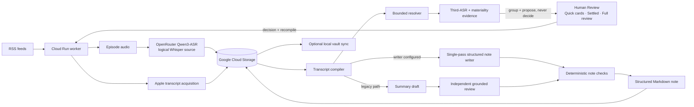

# Architecture

Podcast Automation separates source acquisition, evidence reconciliation, human adjudication, and knowledge generation so that model fluency never silently replaces source evidence.

## Authority boundaries

- **Source transcripts** are evidence, not interchangeable guesses.
- **The logical `Whisper` source** is currently produced by OpenRouter `qwen/qwen3-asr-1.7b`; model, provider, encoding, chunking and stitch identity are provenance-bound so older producers are not silently reused.
- **Python-owned deterministic logic** controls identity, state transitions, evidence IDs, budgets, validation, and publication gates.
- **AI calls** may propose bounded interpretations, materiality judgments or edits only inside explicit contracts.
- **Third-ASR/materiality evidence** can reduce reviewer work but cannot write canonical transcript text by itself.
- **Humans** decide material transcript conflicts that remain unresolved.
- **Google Cloud Storage** is the durable canonical artifact store; local files are working or derivative copies.

When `PODCAST_KNOWLEDGE_WRITER_PRESET` is set, the writer receives the whole compiled transcript and returns a structured `knowledge-note-v3` note with topics, people and tag proposals. Python validates and renders the note, resolves tags, and builds frontmatter. Without that preset, the earlier summary, independent review and metadata chain remains available. Neither path can publish before its checks complete.

## Reliability model

Episode processing is resumable and idempotent. Durable state is written before best-effort notifications. Conflict-sensitive writes use generation preconditions, per-episode AI spend is admitted and settled through the budget ledger, and later runs resume incomplete episodes rather than assuming that the newest RSS item is the only work remaining.
